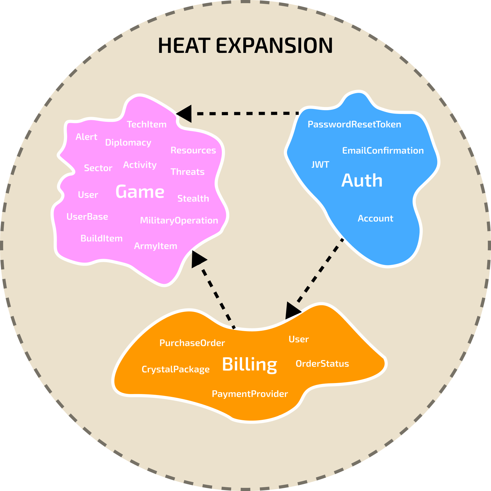

# Heat Expansion Server

Heat Expansion is a Go backend for a multiplayer 4X strategy game.

This repository is structured as a **modular monolith**: multiple services live under `internal/`, with low coupling so that services can be extracted into separate deployables later.

## Services



- **Game**: core gameplay domain, CQRS, HTTP API, persistence.
  - Docs: [internal/game/README.md](internal/game/README.md)

- **Auth**: identity and access management, JWT issuance, integration events.
  - Docs: [internal/auth/README.md](internal/auth/README.md)

- **Billing**: billing/subscription-related code (in progress).
  - Location: `internal/billing`

- **Contracts**: shared integration event schemas and envelope definitions.
  - Location: `contracts/`

## Getting started

1. Install Go, PostgreSQL, and RabbitMQ.
2. Create a `.env` file (see `.env.example`).
3. Apply migrations and run the Server:
   - `make migrate-up`
   - `make run`

Alternatively, use Docker Compose:
```bash
docker-compose up --build
```

The Game Server listens on `GAME_PORT` (default `8080`) and the Auth Server on `AUTH_PORT` (default `8081`).

## Internationalization (i18n)

The server supports multi-language responses based on the `Accept-Language` HTTP header. 

- **Systemic Locales**: Embedded in the binary for stability (errors, system alerts).
- **Content Locales**: Loaded from an external directory at runtime. Point the `GAME_I18N_PATH` environment variable to your translation files.